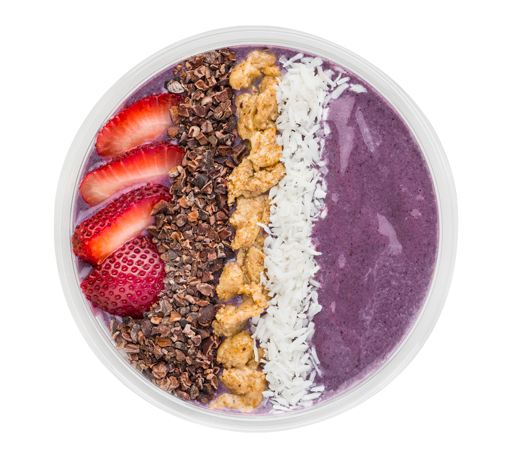

# Recipe Advisor Application

<b>Programming Homework assignment 1 for High School of Economics</b>

  

### Genereal Information

<b>Deadline</b>: April 30th, 23:59:59
It is highly advisable to submit the solution at least 1 hour before the deadline. The deadline is scheduled for 23:59 not for the sake of making students work on the task till late night. A file arriving even with a 1 second delay will still count as a late submission with a 20% downgrade according to the course regulations.

<b>Submission</b>: through the Canvas LMS as a zip archive.
All submussions go through a plagiarism detection software. Solitions having a high level of
similarity (the level is determined by the course teacher) will all receive a 0 grade.

### Introduction

The first graded homework assignment will check your understanding of the core concepts of the course related to data structures and file input and output.

You will need to implement an application that will propose recipes of dishes taking into account the goods that are available in a person’s kitchen.

### Description of tasks

#### Task 1: data structures only, no file input and output

* Make a catalog of recipes. For this, you need to declare a SINGLE data structure that will store the following information: a number of dishes, where each dish is described by its name, difficulty of preparation (low, medium, high), and the ingredients that are required for its preparation. Each ingredient, in turn, is described by its name and quantity (in reality, different ingredients have different measurement units, e.g. grams, teaspoons, liters, however for simplicity we will assume that a single abstract measurement unit is used). The exact description of how the dish is prepared is not needed.
* Make a list of goods (foodstuffs) that a person has at home in the kitchen (milk, cheese, eggs, etc.). Each good has two attributes: name and quantity (again you can assume a single unified measurement unit here).
* Write a recipe selection algorithm, which by analyzing the available goods (second list), makes a list of dishes that a person can make. The algorithm needs to select only those dishes, in which each ingredient will be fully covered by the available goods, i.e. its quantity in the recipe should be less than or equal to the amount of the corresponding good from the second list.
* Implement a simple request response logic. At startup, the application should provide the following choices for the user:
  1. “My kitchen”. On choosing this option, the program falls into the second level menu with the following items:
     1. View all. The program prints information about all available foodstuffs with their quantity
     2. Add good. The program requests the good name, its quantity and adds it to the list (or updates the quantity if the good with the same name already exists in the list)
     3. Back. Return the the top level menu
  2. View recipes. On choosing this option, the program gives a list of all dishes that are present in the catalog (just their names). The user can then choose one dish for a detailed view, the program then prints information about all ingredients, which are needed for the dish preparation
  3. Make a dish. On choosing this option, the program runs the recipe selection algorithm (see above), picks available recipes based on the goods a person has, and offers them for selection. The person then chooses one dish (a cancellation option should also be provided), then the quantities of goods should be decreased by the values from the recipe, i.e. if a person has milk with quantity 200, and a chosen dish requires 50 units of milk, then the remaining quantity should be 150 after the dish preparation.
  4. Exit. On choosing this option, the program terminates.

#### Task 2: file input and output

Move all harccoded data from your program to one or many files. You can use one of the following options:

1. Single file storing the entire program dataset (recipes and goods)
2. Two separate files, one storing recipes, the other storing goods
3. Multiple files for recipes (each recipe in its own file), a separate file for available goods

The choice of file formats is left entirely up to you. This can be your own text, binary format or any of the standard formats (csv, xml, json or others).

Not to change any processing algorithms, load the file data into the data structures of exactly the same type as you designed in the first task.

The recipe data should not change during program execution. However, the list of available goods will change each time a person selects a dish for preparation or adds goods to the kitchen. Make sure the file is updated in the corresponding case.

### Additional requirements

Please read the following requirements carefully, as they affect the final grade. Failure to comply with these will cause a downgrade:

* All the source data should be loaded once at program startup
* Use functions (and possibly, modules) to achieve a better structure of your program
* Add protection against incorrect user input, absense of files or errors in their format
* Use proper code style (informative names of variables, functions), try to follow as many PEP-8 recommendations as possible

### ToDo

- [x] Task 1
- [x] Task 2
- [ ] Check code for <b>"code repeating"</b> and style rules defined in <b>PEP-8</b>
